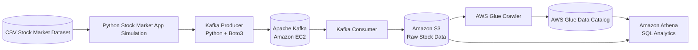

# MarketPulse: Stock Market Real-Time Data Analysis Using Kafka

MarketPulse is a standalone Django project for managing and documenting an end-to-end stock market data engineering pipeline. The architecture simulates stock market events, streams them through Apache Kafka, stores raw market data in Amazon S3, catalogs it with AWS Glue, and queries it with Amazon Athena.

The Django layer provides a secure web application foundation around the pipeline, including admin/auth support, CSRF protection, password validation, environment-based configuration, and a place to add operational controls for producers, consumers, and analytics jobs.

## Architecture


The diagram above shows the original project architecture. The Mermaid version below keeps the same flow in a source-controlled format that renders directly in GitHub Markdown.



## Data Flow

1. A historical CSV stock market dataset is used as the source data.
2. A Python stock market simulation app reads the dataset and emits records like live market events.
3. The Kafka producer publishes simulated stock events into a Kafka topic.
4. Apache Kafka runs on an Amazon EC2 instance and acts as the streaming message broker.
5. The Kafka consumer reads events from the Kafka topic.
6. The consumer writes streaming output to Amazon S3 for durable object storage.
7. AWS Glue Crawler scans the S3 data and infers the table schema.
8. AWS Glue Data Catalog stores table metadata for downstream analytics.
9. Amazon Athena queries the S3 data using SQL.

## Main Components

| Component | Purpose |
| --- | --- |
| Django Web App | Secure control plane and dashboard for the data pipeline. |
| CSV Dataset | Source stock market data used for simulation. |
| Python App | Reads CSV rows and simulates real-time stock events. |
| Kafka Producer | Sends stock records to a Kafka topic. |
| Apache Kafka on EC2 | Distributed streaming platform for ingesting events. |
| Kafka Consumer | Reads Kafka messages and persists them to S3. |
| Amazon S3 | Stores raw or processed stock market data files. |
| AWS Glue Crawler | Detects schema and partitions from S3 data. |
| AWS Glue Data Catalog | Central metadata catalog for Athena queries. |
| Amazon Athena | Serverless SQL query engine for analysis. |

## Example Stock Event Schema

```json
{
  "symbol": "AAPL",
  "trade_time": "2026-06-12T09:30:00Z",
  "open": 194.25,
  "high": 196.10,
  "low": 193.80,
  "close": 195.64,
  "volume": 4839200
}
```

## Example Athena Queries

```sql
-- Preview latest stock events
SELECT *
FROM stock_market_data
ORDER BY trade_time DESC
LIMIT 10;

-- Average closing price by symbol
SELECT
  symbol,
  AVG(close) AS avg_close_price
FROM stock_market_data
GROUP BY symbol
ORDER BY avg_close_price DESC;

-- Total traded volume by symbol
SELECT
  symbol,
  SUM(volume) AS total_volume
FROM stock_market_data
GROUP BY symbol
ORDER BY total_volume DESC;
```

## Suggested Project Structure

```text
marketpulse/
├── dashboard/
│   ├── static/
│   ├── templates/
│   ├── urls.py
│   └── views.py
├── marketpulse/
│   ├── settings.py
│   ├── urls.py
│   ├── asgi.py
│   └── wsgi.py
├── manage.py
├── .env.example
├── requirements.txt
└── README.md
```

## Prerequisites

- Python 3.10 or later
- Django 5.2
- Apache Kafka
- AWS account
- Amazon EC2 instance for Kafka
- Amazon S3 bucket
- AWS Glue database and crawler
- Amazon Athena query setup
- AWS CLI configured with appropriate permissions

## Run the Django App Locally

Create and activate a virtual environment:

```bash
python3 -m venv .venv
source .venv/bin/activate
```

Install dependencies:

```bash
pip install -r requirements.txt
```

Create a local environment file:

```bash
cp .env.example .env
```

Update `.env` with your local values, then run migrations:

```bash
python manage.py migrate
```

Create an admin user:

```bash
python manage.py createsuperuser
```

Start the Django development server:

```bash
python manage.py runserver
```

Open the app at:

```text
http://127.0.0.1:8000/
```

## Security Notes

- Keep `DJANGO_SECRET_KEY`, AWS credentials, Kafka endpoints, and S3 bucket names in environment variables.
- Do not commit `.env` files or cloud credentials.
- Use `DJANGO_DEBUG=False` outside local development.
- Set `DJANGO_ALLOWED_HOSTS` to the real domain or hostnames used in deployment.
- Enable `DJANGO_SECURE_SSL_REDIRECT=True` and a positive `DJANGO_SECURE_HSTS_SECONDS` value behind HTTPS.
- Use Django admin permissions or custom views before exposing producer, consumer, S3, Glue, or Athena controls.

## Pipeline Setup Notes

1. Launch an EC2 instance and install Kafka.
2. Create a Kafka topic for stock market events.
3. Configure the producer to read the CSV dataset and publish messages to Kafka.
4. Configure the consumer to read from Kafka and write records to S3.
5. Create an AWS Glue crawler that points to the S3 bucket or prefix.
6. Run the crawler to populate the AWS Glue Data Catalog.
7. Query the cataloged data from Amazon Athena.

## Publish the Dataset to Kafka

The project includes `kafka_producer.py`, which reads `dataset/indexProcessed.csv` and publishes each row as a JSON event to Kafka.

Default Kafka settings:

```text
Bootstrap server: KAFKA_BOOTSTRAP_SERVERS from .env
Topic: KAFKA_TOPIC from .env
Dataset: dataset/indexProcessed.csv
```

Create the topic from your Kafka container or EC2 Kafka shell:

```bash
make create-topic
```

Run a consumer to verify messages:

```bash
make consumer-from-beginning
```

Publish the dataset:

```bash
make dataset-producer
```

You can also run the producer directly:

```bash
python3 kafka_producer.py \
  --dataset dataset/indexProcessed.csv
```

To test with only a few records:

```bash
python3 kafka_producer.py --limit 10 --delay 0
```

## Publish from the Django UI

Start the Django app and open:

```text
http://127.0.0.1:8000/producer/
```

From this page you can:

- Enter a custom Kafka topic.
- Upload a `.csv`, `.xlsx`, or `.xlsm` dataset.
- Create the topic if it does not already exist.
- Publish all rows or only a limited number of rows.
- Track the run status while the Django server is running.

Uploaded files must follow the stock market template columns:

```text
Index, Date, Open, High, Low, Close, Adj Close, Volume, CloseUSD
```

## Consume Kafka Data to S3

The project includes `kafka_consumer.py`, which reads JSON messages from Kafka and uploads them to S3 as newline-delimited JSON files.

Configure these values in `.env`:

```text
AWS_REGION=us-east-1
S3_BUCKET_NAME=your-s3-bucket-name
S3_OUTPUT_PREFIX=stock-market-events
KAFKA_BOOTSTRAP_SERVERS=your-kafka-host:9092
KAFKA_TOPIC=your-kafka-topic
KAFKA_CONSUMER_GROUP=marketpulse-s3-consumer
```

Run the consumer:

```bash
python3 kafka_consumer.py
```

Or use the Makefile:

```bash
make s3-consumer
```

Useful one-time verification command:

```bash
python3 kafka_consumer.py \
  --topic testing-topic-from-UI \
  --from-beginning \
  --max-messages 10 \
  --batch-size 10
```

The consumer commits Kafka offsets only after a batch is successfully uploaded to S3.

## Land Data in S3 from the Django UI

Start the Django app and open:

```text
http://127.0.0.1:8000/consumer/
```

From this page you can provide:

- Kafka broker
- Kafka topic
- Consumer group
- S3 bucket
- S3 prefix
- AWS region
- Batch size
- Max messages
- From-beginning replay option
- Idle timeout for quiet topics

Click `Land Data in S3` to start a background consumer run. The run table shows status, uploaded message count, destination bucket, prefix, and errors.

## Outcome

This architecture demonstrates a practical real-time analytics pipeline using common data engineering tools. It supports event ingestion, streaming, object storage, schema discovery, metadata cataloging, and SQL-based analytics over stock market data.
